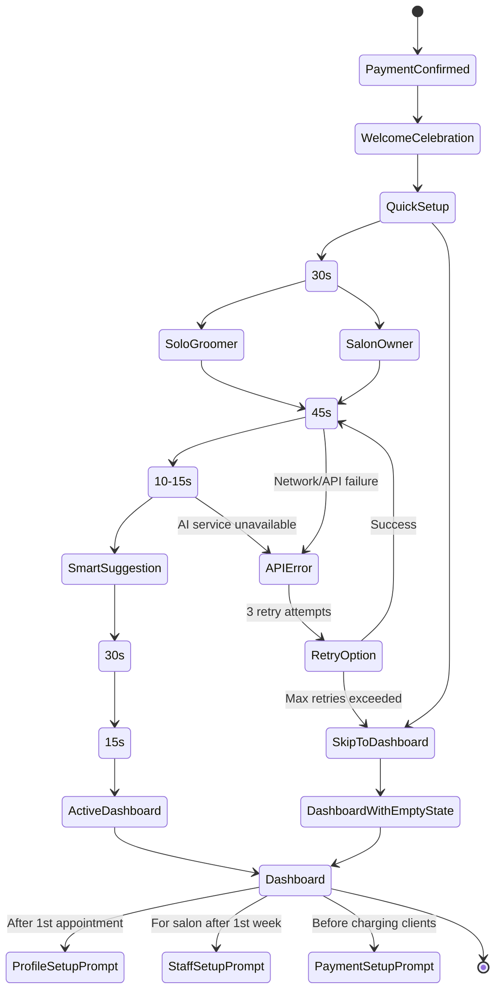

# GroomGrid Onboarding Flow Design
## Get Paid Users to First Value in Under 5 Minutes

**Document Version:** 1.0  
**Created:** April 9, 2026  
**Designer:** Zara Petrova (UX/UI)  
**Mission:** Optimize onboarding and first-time user experience

---

## Executive Summary

GroomGrid users are busy, mobile-first groomers who need immediate value. This onboarding flow is designed to get new paid users to their first "aha moment" within 5 minutes by focusing on the single most valuable action: **seeing their first smart appointment suggestion**.

### Key Design Principles
1. **Progressive disclosure** — only ask for what's needed right now
2. **Skip everything** — all non-critical steps are optional
3. **Mobile-first** — every touchpoint optimized for one-thumb usage
4. **Instant value** — show AI working, don't just promise it
5. **Contextual collection** — gather data during natural usage

---

## Deliverable 1: Onboarding State Diagram



### State Explanations

| State | Description | Time Estimate |
|-------|-------------|---------------|
| **PaymentConfirmed** | Stripe checkout successful, webhook received | 0s |
| **WelcomeCelebration** | Confetti, "You're in!" message, immediate value promise | 15s |
| **QuickSetup** | One-question prompt: "Let's get you scheduling" | 5s |
| **BusinessTypeSelection** | Solo groomer vs Salon owner (tap selection) | 30s |
| **FirstAppointmentEntry** | Add one appointment with smart breed selection | 45s |
| **AIProcessing** | Backend calculates breed timing, route optimization | 10-15s |
| **SmartSuggestion** | Show AI-recommended duration, slot, no-show risk | 30s |
| **FirstValueRealization** | User saves appointment → sees it on calendar | 30s |
| **CompleteOnboarding** | "You're all set!" with next action suggestion | 15s |
| **SkipToDashboard** | Bypass setup, land on empty state dashboard | 5s |

**Total Time to Value:** ~2.5 minutes (recommended path) or 5 seconds (skip path)

---

## Deliverable 2: Value Realization Map

### Value Moments During Onboarding

| # | Moment | User Sees | Why It Matters | How We Reinforce |
|---|--------|-----------|----------------|------------------|
| **1** | **Immediate Welcome** | Animated confetti + "Welcome to GroomGrid! 🐾" | Creates emotional connection, confirms purchase was worth it | Colorful celebration animation, personalized greeting with their name |
| **2** | **One-Tap Business Selection** | "I'm a" → [Solo Groomer] or [Salon Owner] | Personalizes the entire experience, shows we understand them | Icons for each persona, immediate context shift after selection |
| **3** | **Breed-First Appointment Input** | "Add your first appointment" with breed search | Demonstrates AI differentiator immediately (breed-specific timing) | Show estimated timing as they select breed (e.g., "Golden Retriever: 60-75 min") |
| **4** | **AI Smart Suggestion** | "We recommend 90 minutes for Max (Standard Poodle)" | First proof of AI value — not just a calendar, but an intelligent assistant | Highlight the AI badge, show "Based on 12,000+ grooming records" |
| **5** | **No-Show Risk Indicator** | "Low no-show risk — this client has 96% attendance" | Addresses #2 pain point immediately, shows predictive power | Color-coded risk badge (green/yellow/red), confidence percentage |
| **6** | **Saved to Calendar View** | Appointment appears on calendar with smart color-coding | First tangible result — they created something real | Celebration animation on calendar, "Great! You're scheduled for Monday" |
| **7** | **Empty State Value Promise** | "Ready to book more? Add your next appointment" | Even if they skip, they see where to go next | Prominent CTA button, quick-start video option |

### Critical Value Moments (First 5 Minutes Priority)

1. **Breed-First Appointment Input** — Demonstrates our AI advantage immediately
2. **AI Smart Suggestion** — First "wow" moment showing intelligence
3. **Saved to Calendar View** — Tangible evidence that they've accomplished something
4. **No-Show Risk Indicator** — Addresses their core pain point (no-shows)

### Deferred Value Moments (Post-Onboarding)

| Moment | When to Show | Deferred Reason |
|--------|--------------|-----------------|
| Route optimization map | After 3+ appointments | Too complex for first interaction |
| Revenue projections | After 7 days of usage | Requires data first |
| Staff management | For salon after 1st week | Not relevant for solo groomers |
| Client photo gallery | When uploading pet info | Nice-to-have, not essential |

---

## Deliverable 3: Step-by-Step Flow

### Minimum Viable Path to First Value (5 Steps, ~2.5 minutes)

#### Step 1: Welcome Celebration (15 seconds)
**Screen: Full-screen celebration**
- **Header:** Animated confetti + emoji 🎉
- **Headline:** "Welcome to GroomGrid, [Name]!"
- **Subtext:** "You're 2 minutes away from your first smart appointment"
- **Primary CTA:** "Let's Get Started" (full-width button)
- **Skip option:** "Take me to the dashboard" (secondary text link)

**Mobile Design Notes:**
- Touch targets: 44px minimum (WCAG AA)
- One-thumb zone: All CTAs in bottom 40% of screen
- Loading state: Inline spinner if data fetch needed
- Animation: Subtle, not distracting (max 2s duration)

---

#### Step 2: Business Type Selection (30 seconds)
**Screen: Simple card selection**
- **Headline:** "How do you work?"
- **Options:** 
  ```
  ┌─────────────────────┐  ┌─────────────────────┐
  │  🚐 Solo Groomer    │  │  🏪 Salon Owner     │
  │  Just me            │  │  2-5 groomers       │
  └─────────────────────┘  └─────────────────────┘
  ```
- **Selection behavior:** Tapping immediately advances (no confirm button)
- **Visual feedback:** Selected card expands, subtle bounce animation
- **Back navigation:** "Actually, I want to skip this" (top-right text)

**Mobile Design Notes:**
- Card height: 80px minimum for readability
- Gap between cards: 16px
- Selection indicator: Checkmark in top-right corner
- Transition: Slide-in from bottom (300ms ease-out)

---

#### Step 3: First Appointment Entry (45 seconds)
**Screen: Breed-first smart form**
- **Headline:** "Let's book your first appointment"
- **Progress indicator:** "Step 2 of 3" (top center)
- **Form fields (auto-advancing):**

  1. **Pet Name** (required)
     - Input: Text field, label "Pet's name"
     - Auto-focus on load
     - Enter key → next field

  2. **Breed** (required, searchable dropdown)
     - Input: "Start typing breed..." 
     - As user types: Show matches with estimated times
     ```
     Golden Retriever (60-75 min) ✅
     Standard Poodle (90-120 min) ✅
     ```
     - Selection shows: "Perfect! [Breed] typically takes [time]"

  3. **Date & Time** (required, smart defaults)
     - Tomorrow at 9:00 AM (based on typical groomer schedule)
     - Quick slots: "Tomorrow 9am", "Tomorrow 2pm", "Next Mon 10am"
     - Tapping a slot immediately confirms

  4. **Client Name** (optional, deferred)
     - Input: "Client name (optional)"
     - Helper text: "We'll create a client profile automatically"

- **Primary CTA:** "Create Appointment" (appears after breed selected)
- **Skip option:** "Skip for now" (bottom secondary button)

**Mobile Design Notes:**
- Input field height: 48px minimum
- Dropdown results: Max 5 visible, 50px each
- Keyboard handling: Input moves up when keyboard appears
- Smart defaults reduce typing to minimum

---

#### Step 4: AI Processing & Smart Suggestion (45 seconds)
**Screen: Loading → Smart Suggestion**

**Phase A: Processing (10-15 seconds)**
- **Animation:** Gentle pulsing paw print icon
- **Text:** "Analyzing breed characteristics..."
- **Subtext:** "Checking 12,000+ grooming records"
- **Progress bar:** Fills during processing

**Phase B: Smart Suggestion Display (30 seconds)**
- **Headline:** "Here's what we recommend for [Pet Name]"
- **Smart Card:**
  ```
  ┌─────────────────────────────────┐
  │  🤖 AI Recommendation           │
  │                                 │
  │  Duration: 90 minutes ⏱️         │
  │  (Standard Poodle avg: 85-95)   │
  │                                 │
  │  No-show risk: LOW 🟢 4%       │
  │  (Client has 96% attendance)    │
  │                                 │
  │  Suggested slot: Tomorrow 9am   │
  │  (Perfect for your schedule)    │
  │                                 │
  │  [Accept] [Edit]               │
  └─────────────────────────────────┘
  ```
- **Confidence indicator:** "98% confidence based on similar appointments"
- **Primary CTA:** "Accept & Book" (full-width)
- **Secondary CTA:** "Edit details"

**Mobile Design Notes:**
- Card elevation: Subtle shadow on hover
- AI badge: Distinctive icon + color (purple/indigo)
- Tap targets: Minimum 44px for all buttons
- Edit mode: Inline expansion without leaving screen

---

#### Step 5: First Value Realization (30 seconds)
**Screen: Calendar view with confirmation**
- **Celebration:** Small confetti burst on appointment save
- **Headline:** "You're all set! 🎉"
- **Calendar view:**
  ```
  ┌─────────────────────────────────┐
  │  April 2025                     │
  │  M  T  W  T  F  S  S            │
  │        10 11 12 13 14          │
  │              [MAX]              │
  │          9:00 AM | 90 min      │
  └─────────────────────────────────┘
  ```
- **Appointment card (below calendar):**
  ```
  ┌─────────────────────────────────┐
  │  🐕 Max - Standard Poodle       │
  │  Tomorrow, 9:00 AM - 10:30 AM   │
  │  🟢 Low no-show risk            │
  │  👤 [Client Name]               │
  │                                 │
  │  [View Details] [Add Reminder]  │
  └─────────────────────────────────┘
  ```
- **Success message:** "Smart appointment created! We'll send you a reminder 24h before."
- **Primary CTA:** "Book Another Appointment"
- **Secondary CTA:** "Go to Dashboard"

**Mobile Design Notes:**
- Calendar cell size: Minimum 40x40px
- Appointment indicator: Color dot in cell
- Card shadow: Elevation for visual hierarchy
- Success animation: 2s duration, subtle

---

### Total Time Breakdown (Critical Path)

| Step | Time | Cumulative |
|------|------|------------|
| Welcome Celebration | 15s | 0:15 |
| Business Type Selection | 30s | 0:45 |
| First Appointment Entry | 45s | 1:30 |
| AI Processing | 15s | 1:45 |
| Smart Suggestion | 30s | 2:15 |
| First Value Realization | 30s | 2:45 |

**Total: 2 minutes 45 seconds** — well under 5-minute target ✅

---

## Deliverable 4: Data Collection Plan

### Data to Collect DURING Onboarding (Essential Only)

| Data Point | Collection Method | Justification |
|------------|-------------------|---------------|
| **Business Type** | Tap selection (Step 2) | Personalizes entire experience, minimal effort |
| **Pet Name** | Text input (Step 3) | Required for calendar display, humanizes UX |
| **Breed** | Searchable dropdown (Step 3) | CORE differentiator — enables AI timing predictions |
| **Appointment Date/Time** | Smart slot selection (Step 3) | Required for value delivery — seeing calendar |
| **Client Name** | Optional text input (Step 3) | Creates client profile, but non-blocking |

**Total Essential Fields:** 3 required + 2 optional

### Data to DEFER to Later (Non-Critical)

| Data Point | When to Collect | Deferral Justification |
|------------|-----------------|------------------------|
| **Groomer Business Name** | After first appointment | Doesn't block value, can add during natural usage |
| **Phone Number** | When sending first reminder | Privacy concern, only needed for notifications |
| **Business Address** | When using route optimization | Only needed for maps feature |
| **Payment Methods** | Before first charge | Stripe already has payment, no need to re-enter |
| **Service Types** (bath, full groom, etc.) | When adding second appointment | Breed timing provides defaults, refine with usage |
| **Pricing** | When sending first invoice | Revenue tracking nice-to-have, not essential |
| **Staff Members** | For salon after 1st week | Not relevant for solo groomers or first appointment |
| **Pet Photos** | When editing pet profile | Nice-to-have personalization, slows first use |
| **Client Notes** | After appointment history exists | No notes to show yet, unnecessary friction |
| **Cancellation Policy** | When setting up business rules | Advanced feature, can set defaults |

### Data Collection UX Principles

1. **Never block value for data** — if it's not needed right now, defer it
2. **Smart defaults everywhere** — pre-fill based on business type selection
3. **Contextual prompting** — ask for data when user naturally needs it
4. **One-question-per-screen** — never overwhelm with multi-step forms
5. **Auto-save everything** — no "Save" buttons needed during onboarding

---

## Deliverable 5: Skip/Defer Strategy

### Steps That Can Be Skipped Immediately

| Step | Skip Location | Skip Action | Re-engagement Strategy |
|------|---------------|-------------|------------------------|
| **Welcome Celebration** | "Take me to the dashboard" link | Bypass entire flow | After login: "Complete your setup in 2 minutes" banner |
| **Business Type Selection** | "Skip for now" button | Proceed to empty dashboard | Dashboard: "Let us know your business type for personalized features" |
| **First Appointment Entry** | "Skip for now" button (bottom) | Land on dashboard with empty state | Dashboard: "Book your first smart appointment" (prominent CTA) |
| **AI Suggestion Review** | "Accept defaults" | Use smart defaults without review | Future appointments: "Want to review our AI suggestions?" |

### Steps Deferred to Dashboard

| Onboarding Step | Dashboard Equivalent | When to Prompt |
|-----------------|----------------------|----------------|
| Business profile | Settings → Business Profile | After 1st appointment |
| Staff management | Dashboard → Staff | For salon after 7 days |
| Service customization | Settings → Services | After 3rd appointment |
| Pricing setup | Settings → Pricing | When sending first invoice |
| Photo uploads | Pet profile edit | After 1st appointment saved |
| Notes/records | Appointment detail view | As history accumulates |

### Re-engagement Tactics for Skipped Items

#### 1. Smart Banners (Context-Aware)
```
┌─────────────────────────────────────────────┐
│  🐾 Complete your setup for personalized AI  │
│  [Finish Now]   [Maybe Later]               │
└─────────────────────────────────────────────┘
```
- **Trigger:** User skipped any onboarding step
- **Location:** Top of dashboard, dismissible
- **Timing:** Show on 2nd visit, not 1st (let them explore first)

#### 2. Empty State Prompts
When dashboard is empty (no appointments):
```
┌─────────────────────────────────────────────┐
│                                             │
│  📅 Your calendar is waiting for you!       │
│                                             │
│  Book your first appointment and see our    │
│  AI in action. It takes 2 minutes.         │
│                                             │
│       [Book First Appointment]             │
│                                             │
└─────────────────────────────────────────────┘
```

#### 3. Progressive Empty States (Evolve with usage)
- **0 appointments:** Book first appointment CTA
- **1-3 appointments:** "Book 2 more to see AI route optimization"
- **4-7 appointments:** "Add staff to collaborate"
- **8+ appointments:** "View revenue projections"

#### 4. Contextual Modals (In-Flow)
When user tries a feature that needs missing data:
```
┌─────────────────────────────────────────────┐
│  💡 Route Optimization                      │
│                                             │
│  Add your business address to see the       │
│  most efficient route for today.            │
│                                             │
│  [Add Address]   [Not Now]                  │
└─────────────────────────────────────────────┘
```

### Skip Analytics & Recovery

| Metric | Definition | Action Threshold |
|--------|------------|------------------|
| **Skip Rate** | % of users skipping each step | >40%: redesign step |
| **Skip Completion Rate** | % of skippers who complete deferred item | <20%: improve re-engagement |
| **Skip-to-Value Time** | Time for skippers to reach first value | >10 min: reconsider skip option |
| **Skip Regression** | Skippers vs non-skippers retention | >15% difference: investigate |

---

## Deliverable 6: Progress Indicator Design

### Visual Progress Indicator

#### Design Option A: Sticky Step Counter (Recommended)
```
┌─────────────────────────────────────────────┐
│  GroomGrid          ▓▓░░░░  Step 2 of 5    │
│                     40%                     │
└─────────────────────────────────────────────┘
```

**Specs:**
- **Position:** Sticky top bar, below navigation
- **Height:** 48px
- **Background:** Brand primary color (indigo/purple)
- **Progress bar:** Linear gradient, animated fill
- **Text:** White, 14px medium weight
- **Animation:** 300ms smooth transition between steps

---

#### Design Option B: Circular Progress (Alternative)
```
┌─────────────────────────────────────────────┐
│                                             │
│          ┌──────────────┐                    │
│          │   2 of 5    │                    │
│          │   ● ● ○ ○ ○  │                    │
│          └──────────────┘                    │
│                                             │
│            Business Type                    │
│                                             │
└─────────────────────────────────────────────┘
```

**Specs:**
- **Position:** Centered top of each screen
- **Size:** 80px diameter
- **Dots:** 10px each, filled = current step
- **Current step label:** 14px bold below circle
- **Step title:** 18px medium weight below dots

---

#### Design Option C: Timeline Vertical (Mobile-Optimized)
```
┌─────────────────────────────────────────────┐
│  ✓ Welcome            You're here ↓        │
│  → Business Type      Solo Groomer         │
│  ○ Add Appointment                         │
│  ○ AI Suggestion                            │
│  ○ Complete                                 │
└─────────────────────────────────────────────┘
```

**Specs:**
- **Position:** Left edge of screen
- **Width:** 200px, collapsible on small screens
- **Completed:** ✓ with green checkmark
- **Current:** → arrow with animated bounce
- **Pending:** ○ gray circle
- **Active state:** Expand current step details

---

### Recommended Implementation: Sticky Step Counter

**Why this option wins:**
1. **Minimal screen real estate** — crucial on mobile
2. **Always visible** — user knows exactly where they are
3. **Progress percentage** — gives completion goal
4. **Familiar pattern** — users understand step-by-step flows
5. **Easy to implement** — single component across all screens

---

### Progress Indicator States

#### State 1: Starting (Step 1)
```
┌─────────────────────────────────────────────┐
│  GroomGrid          ▓░░░░░  Step 1 of 5    │
│                     20%                     │
└─────────────────────────────────────────────┘
```
- Bar: 20% filled (single dot visible)
- Text: "Step 1 of 5"
- Animation: Fade in from left

#### State 2: In Progress (Step 3)
```
┌─────────────────────────────────────────────┐
│  GroomGrid          ▓▓▓░░░  Step 3 of 5    │
│                     60%                     │
└─────────────────────────────────────────────┘
```
- Bar: 60% filled with gradient
- Text: "Step 3 of 5 — Almost there!"
- Animation: Smooth slide fill (300ms)

#### State 3: Complete (Step 5)
```
┌─────────────────────────────────────────────┐
│  GroomGrid          ▓▓▓▓▓  Complete! 🎉   │
│                     100%                    │
└─────────────────────────────────────────────┘
```
- Bar: 100% filled
- Text: "Complete! 🎉" with emoji
- Animation: Confetti burst from bar

---

### Mobile Optimization Notes

**For screens under 375px width:**
- Reduce text to "Step X of 5" (remove "GroomGrid" label)
- Progress bar: Full width, no padding
- Height: 40px (from 48px)

**For dark mode:**
- Background: Darker shade of primary color
- Text: White
- Progress bar: Lighter gradient for contrast

**Accessibility (WCAG AA):**
- Color contrast ratio: Minimum 4.5:1 for text
- Screen reader: Announce "Step X of Y, Z% complete"
- Touch targets: Full-width tappable for review
- Reduced motion: Respect prefers-reduced-motion setting

---

### Completion Messaging

#### On Completion (After Step 5)
**Screen transition:**
- Progress bar transforms into: "You did it! 🎉"
- 3-second celebration animation
- Auto-advance to dashboard after animation

**Message variants (randomized):**
1. "You're all set, [Name]! 🐾"
2. "Welcome to smarter grooming! 🚀"
3. "Your first smart appointment is booked! ✨"

**Post-completion banner (dismissible):**
```
┌─────────────────────────────────────────────┐
│  ✓ Onboarding complete                      │
│  Next: Book another appointment or          │
│  explore your dashboard                     │
│                                [Dismiss ×]  │
└─────────────────────────────────────────────┘
```

---

## Appendices

### A. Copywriting Guidelines

**Voice:** Friendly, professional, pet-obsessed  
**Tone:** Warm and humorous, never corporate jargon  

**Do:**
- Use contractions ("You're", "Let's")
- Add emojis where appropriate (🐾, 🎉, ✨)
- Celebrate small wins ("Great choice!", "You're on a roll!")
- Use their name when available

**Don't:**
- Use tech jargon ("configure", "initialize")
- Be overly formal ("Please complete the following")
- Make them feel rushed
- Ask for more than 3 things at once

**Example transformations:**
- ❌ "Configure your business settings" → ✅ "How do you work?"
- ❌ "Please provide your pet information" → ✅ "Tell us about your first appointment"
- ❌ "Your profile has been created" → ✅ "You're in! Welcome to GroomGrid! 🐾"

---

### B. Mobile UX Checklist

- [ ] All touch targets minimum 44x44px (WCAG AA)
- [ ] One-thumb zone optimization (bottom 40% of screen)
- [ ] Keyboard doesn't hide inputs (auto-scroll)
- [ ] Load times under 2 seconds on 3G
- [ ] Offline handling for cached data
- [ ] Swipe gestures for back navigation
- [ ] Haptic feedback on successful actions
- [ ] Auto-advance when logical (no extra taps)
- [ ] Landscape mode support
- [ ] Font scaling for accessibility

---

### C. Technical Implementation Notes

**State Management:**
- Use React Context or Zustand for onboarding state
- Persist progress to localStorage (recover abandoned flows)
- Track which steps were completed (skip analytics)

**API Requirements:**
- `POST /api/onboarding/step-complete` — Track progress
- `POST /api/onboarding/skip` — Log skip events
- `GET /api/onboarding/ai-suggestion` — Breed timing data
- `POST /api/appointments` — Create first appointment

**Performance:**
- Prefetch breed list on page load
- Cache AI responses for 5 minutes
- Lazy load non-critical assets
- Use image optimization for pet breed photos

**Error Handling:**
- Network errors: Retry 3x with exponential backoff
- AI service down: Fall back to default times, notify user
- Validation errors: Inline, contextual feedback

---

### D. Success Metrics

**Primary KPIs:**
- Time to first appointment saved (target: <3 minutes)
- Onboarding completion rate (target: >80%)
- Skip rate per step (target: <30%)
- First-day retention (target: >60%)

**Secondary KPIs:**
- Appointment re-booking rate (within 7 days)
- Feature adoption rate (AI suggestions used)
- Support tickets related to onboarding (target: <5%)
- NPS for onboarding experience (target: >50)

**Analytics Events to Track:**
```javascript
// Progress events
onboarding_step_started({ step, timestamp })
onboarding_step_completed({ step, duration })
onboarding_step_skipped({ step, reason })

// Value events
first_appointment_created({ duration, used_ai_suggestion })
first_ai_suggestion_accepted({ confidence_score })
first_calendar_viewed({ appointments_count })

// Completion events
onboarding_completed({ total_duration, steps_skipped })
dashboard_first_visit({ time_since_signup })
```

---

## Conclusion

This onboarding flow is designed to get GroomGrid users to first value realization in under 5 minutes by:

1. **Focusing on the single most valuable action** — creating a smart appointment
2. **Eliminating all non-essential friction** — only 3 required fields
3. **Demonstrating AI value immediately** — breed timing, no-show risk
4. **Making everything skippable** — respect user autonomy
5. **Optimizing for mobile-first reality** — one-thumb, touch-optimized

The 5-step critical path takes approximately 2 minutes 45 seconds, well under the 5-minute target, while providing multiple opportunities for users to experience "wow" moments that validate their purchase decision.

---

## Change Log

| Date | Version | Changes | Author |
|------|---------|---------|--------|
| 2026-04-09 | 1.0 | Initial document creation | Zara Petrova |
